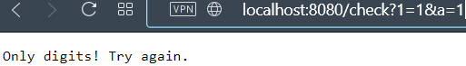

### Сделано на костылях

Для того, что б сделать нормальный контроллер, пришлось бы полностью перекроить сервисы. Делать мне этого не хотелось.

Поэтому в методах контроллеров получаю инты и лонги из пути или параметров, а в сервис отправляю строкой (как это выглядело в запросе).

Возвращается из сервиса Result.Success с готовым json или Result.Fail с сообщением и кодом ошибки.

Это тоже не правильно, т.к. бизнес-логика (сервисы) должна оперировать своими моделями, а не отдавать удобную для отображения модель, но...

+победить liquibase так и не смог, сначала нужно создать базу (CREATE DATABASE products;), а потом уже запускать проект (таблицы liquibase создаст и заполнит).

