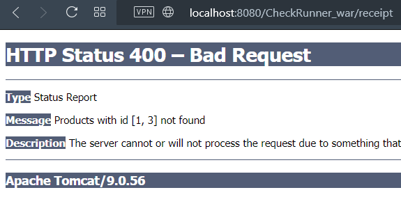

### С jdbc и servlet вроде всё. Местами вижу, где надо исправить, но...

### Четвертый пункт сделал на костылях.   Пытался прикрутить liquibase, но получалась какая-то фигня:   таблицы создавались в public, а вкорячить схему products не получалось.   В итоге база создается через @WebListener, который стучится в util/jdbc/DatabaseInitializer.main().

### Работа с products
#### Получение продуктов с пагинацией:
GET `http://localhost:8080/CheckRunner/products?last_index=2&page_size=3`  
Важно! Передаётся именно last_index - индекс последнего продукта на текущей странице. 
Переделать на передачу номера страницы не проблема, но...
#### Получение продукта
GET `http://localhost:8080/CheckRunner/products?id=3`
#### Удалить продукт
DELETE `http://localhost:8080/CheckRunner/products?id=3`
#### Добавить продукт
POST `http://localhost:8080/CheckRunner/products`  

body `{"title":"title","priceInCents":123,"description":"desc desc","producer":{"companyId":4,"companyName":"LENOVO","companyAddress":"someaddress","companyTelNumber":"61237278"},"barcode":123,"onSale":true}`

Тут ещё можно вместо бизнес-модели использовать отдельную dto с company_id вместо полноценного объекта company. Но, тогда придётся ещё проверять на валидность id (есть ли такой в базе).
#### Обновить продукт
PUT `http://localhost:8080/CheckRunner/products  `
body `{"id":"4","title":"title","priceInCents":123,"description":"desc desc","producer":{"companyId":4,"companyName":"LENOVO","companyAddress":"someaddress","companyTelNumber":"61237278"},"barcode":123,"onSale":true}`

### Работа с cards аналогична, только начинается с http://localhost:8080/CheckRunner/cards
#### Добавить карту
POST `body {"cardType":"PLATINUM"}`
#### Oбновить карту
PUT `body {"id":3,"cardType":"PLATINUM"}`
#### Получение чека
##### Выдаст ошибку, если ранее была удалена одна из позиций или карта
GET `http://localhost:8080/CheckRunner/receipt?1=8&4=2&7=6&9=1&card_id=4`

